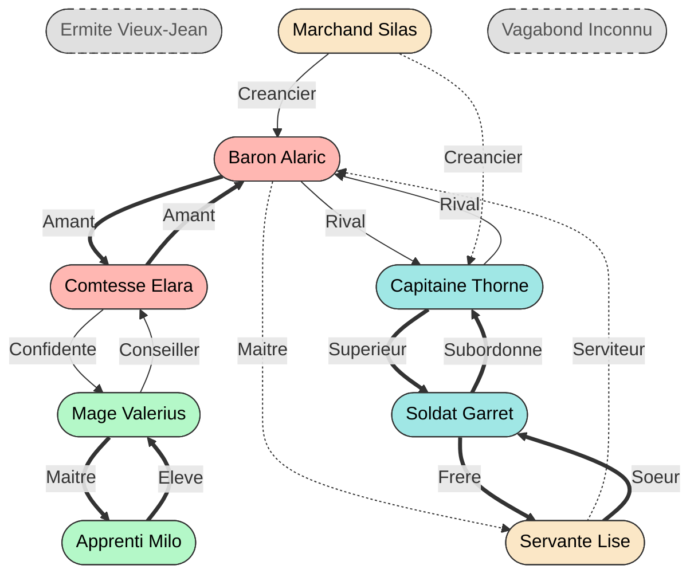
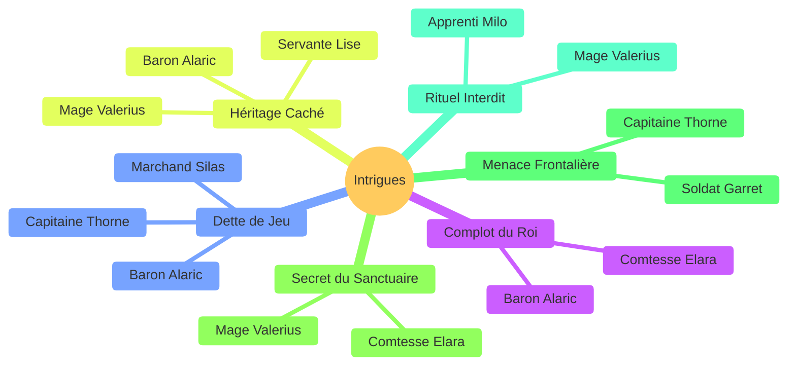
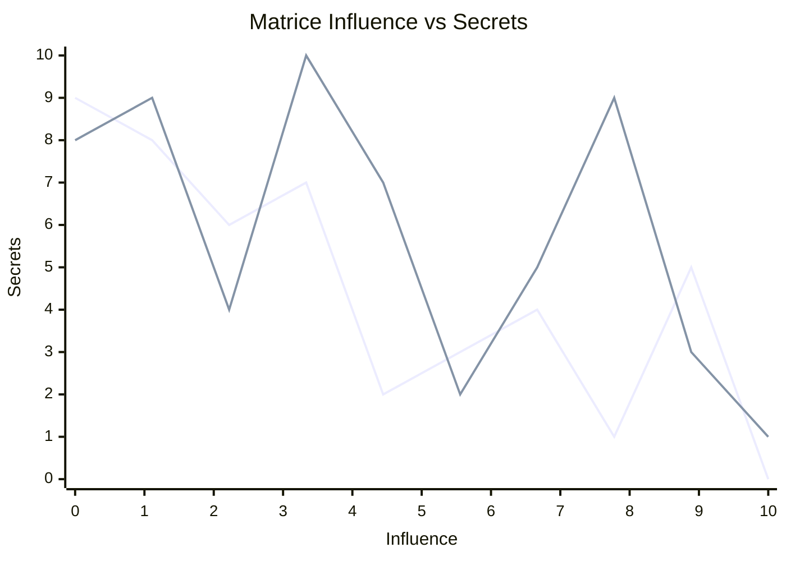
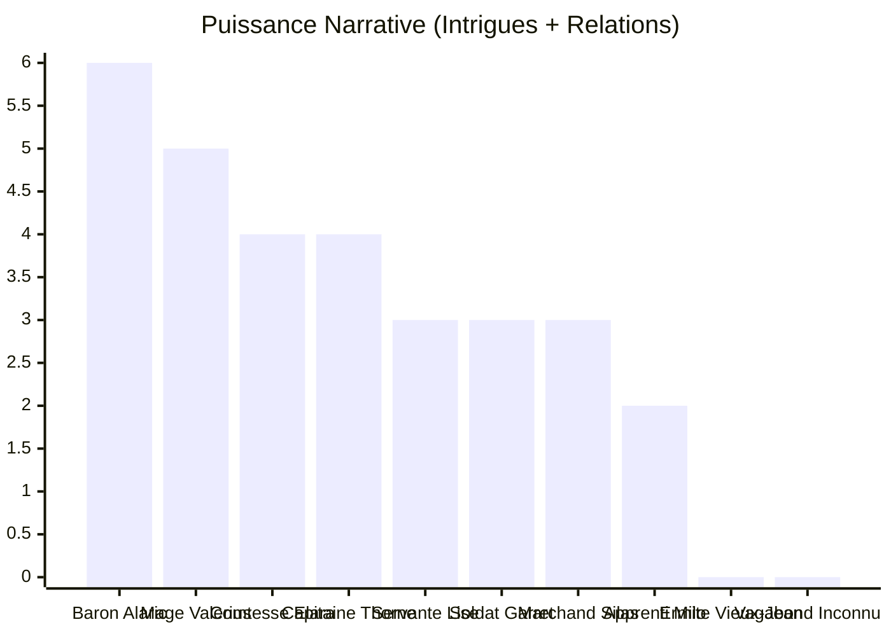
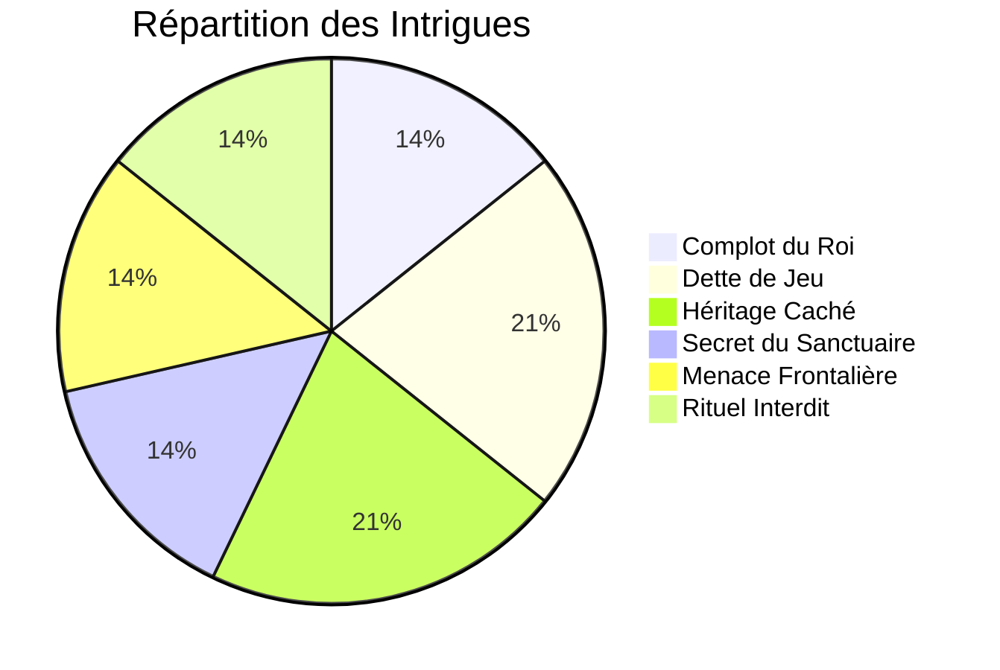
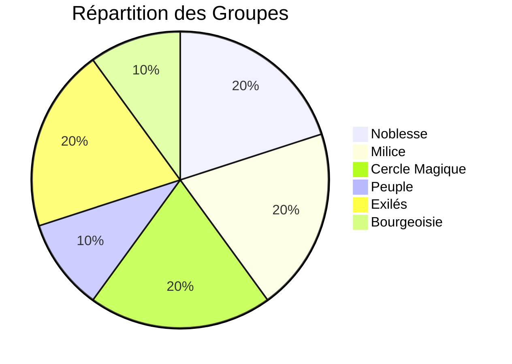

# Rapport d'Analyse GN

## 1. Graphe Relationnel
Visualisation des liens entre personnages. 
- **Trait plein** : Relation Moyenne
- **Trait gras** : Relation Forte
- **Trait pointillé** : Relation Faible

## 2. Cartographie des Intrigues (Mindmap)
Vue d'ensemble des intrigues et des personnages impliqués.

## 3. Matrice Influence / Secrets
Comparaison de l'influence politique et des secrets détenus par chaque personnage.

## 4. Puissance Narrative
Estimation de la charge de jeu (Nombre d'intrigues + Nombre de relations).
Permet d'identifier les personnages surchargés ou délaissés.

## 5. Répartition des Intrigues
Quelles sont les intrigues les plus connectées ?

## 6. Répartition des Groupes

